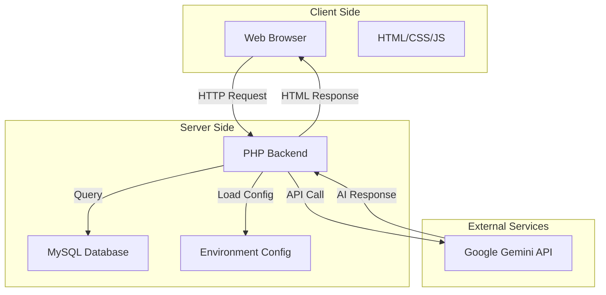
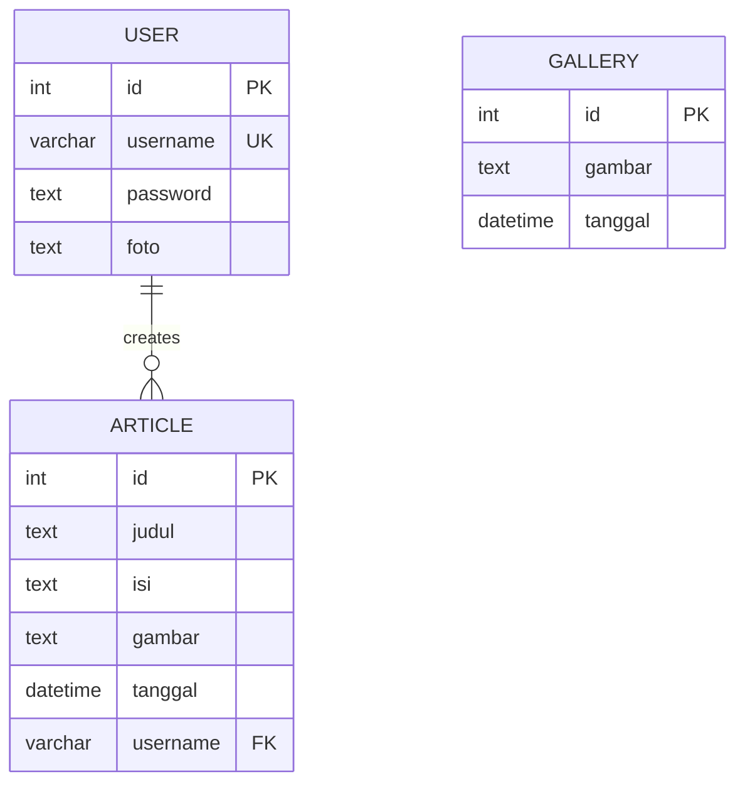

# 🛠️ Technical Development Guide - Building Similar Web Application

Panduan teknis lengkap untuk membuat web application serupa dari awal. Dokumentasi ini cocok untuk developer yang ingin belajar atau membuat website dengan fitur serupa.

---

## 📐 Arsitektur Sistem

### High-Level Architecture



### Technology Stack Details

| Layer | Technology | Version | Purpose |
|-------|-----------|---------|---------|
| **Frontend** | HTML5 | - | Structure |
| | CSS3 | - | Styling |
| | Bootstrap | 5.3.8 | UI Framework |
| | JavaScript | ES6+ | Client Logic |
| | jQuery | 3.7.1 | DOM Manipulation |
| **Backend** | PHP | 8.x | Server Logic |
| | MySQL | 8.x / MariaDB | Database |
| **External** | Gemini API | 2.0 Flash | AI Content |

---

## 🎯 Prinsip Desain

### 1. **MVC-Like Pattern**
Meski tidak strictly MVC, aplikasi ini mengikuti separation of concerns:
- **View**: HTML files di `index.php`, `admin.php`, dll
- **Controller**: Logic di `article_data.php`, `gallery_data.php`
- **Model**: Database queries di `koneksi.php`

### 2. **Configuration Management**
- Environment variables untuk sensitive data
- Centralized config loader (`config.php`)
- `.gitignore` untuk security

### 3. **Modular Design**
- Reusable components (`koneksi.php`, `upload_foto.php`)
- Include-based architecture
- Separation antara admin & public pages

---

## 🗄️ Database Design

### ERD (Entity Relationship Diagram)



### Table Structures

#### **Table: article**
```sql
CREATE TABLE `article` (
  `id` int(11) NOT NULL AUTO_INCREMENT,
  `judul` text DEFAULT NULL,
  `isi` text DEFAULT NULL,
  `gambar` text DEFAULT NULL,
  `tanggal` datetime DEFAULT NULL,
  `username` varchar(50) DEFAULT NULL,
  PRIMARY KEY (`id`)
) ENGINE=InnoDB DEFAULT CHARSET=utf8mb4;
```

**Design Decisions:**
- `TEXT` untuk judul & isi (unlimited length)
- `DATETIME` untuk timestamp flexibility
- `username` sebagai soft foreign key (no constraint)

#### **Table: gallery**
```sql
CREATE TABLE `gallery` (
  `id` int(11) NOT NULL AUTO_INCREMENT,
  `gambar` text NOT NULL,
  `tanggal` datetime NOT NULL,
  PRIMARY KEY (`id`)
) ENGINE=InnoDB DEFAULT CHARSET=utf8mb4;
```

#### **Table: user**
```sql
CREATE TABLE `user` (
  `id` int(11) NOT NULL AUTO_INCREMENT,
  `username` varchar(50) NOT NULL,
  `password` text NOT NULL,  -- MD5 hash (DEPRECATED!)
  `foto` text NOT NULL,
  PRIMARY KEY (`id`),
  UNIQUE KEY `username` (`username`)
) ENGINE=InnoDB DEFAULT CHARSET=utf8mb4;
```

**Security Note:**
> ⚠️ MD5 adalah hash algorithm yang **tidak aman**. Untuk production, gunakan `password_hash()` dan `password_verify()`.

---

## 🔧 Backend Implementation

### 1. **Database Connection (`koneksi.php`)**

```php
<?php
// Load environment variables
require_once __DIR__ . '/config.php';

// Set timezone
date_default_timezone_set('Asia/Jakarta');

// Database credentials from environment
$servername = env('DB_HOST');
$username = env('DB_USER');
$password = env('DB_PASS');
$db = env('DB_NAME');

// Create MySQLi connection
$conn = new mysqli($servername, $username, $password, $db);

// Error handling
if ($conn->connect_error) {
    die("Connection failed: " . $conn->connect_error);
}

// Set charset
$conn->set_charset("utf8");
?>
```

**Key Concepts:**
- ✅ Environment variables untuk credentials
- ✅ Error handling dengan informative messages
- ✅ UTF-8 charset untuk international characters
- ✅ Timezone setting untuk consistency

### 2. **Environment Configuration (`config.php`)**

```php
<?php
/**
 * Environment Variables Loader
 * Secure configuration management
 */

function loadEnv($path = __DIR__ . '/.env') {
    if (!file_exists($path)) {
        throw new Exception('.env file not found!');
    }

    $lines = file($path, FILE_IGNORE_NEW_LINES | FILE_SKIP_EMPTY_LINES);
    
    foreach ($lines as $line) {
        // Skip comments
        if (strpos(trim($line), '#') === 0) continue;
        
        // Parse KEY=VALUE
        if (strpos($line, '=') !== false) {
            list($key, $value) = explode('=', $line, 2);
            $key = trim($key);
            $value = trim($value);
            
            // Set environment variable
            if (!array_key_exists($key, $_ENV)) {
                $_ENV[$key] = $value;
                putenv("$key=$value");
            }
        }
    }
}

// Helper function
function env($key, $default = null) {
    return $_ENV[$key] ?? getenv($key) ?? $default;
}

// Load on initialization
loadEnv();
?>
```

**Why This Approach?**
1. ✅ **Security**: No hardcoded credentials in code
2. ✅ **Flexibility**: Easy to change per environment
3. ✅ **Git-safe**: `.env` in `.gitignore`
4. ✅ **Simplicity**: No external dependencies

### 3. **CRUD Operations Pattern**

**Example: Article Management (`article_data.php`)**

```php
<?php
session_start();
include "koneksi.php";

// Authentication check
if (!isset($_SESSION['username'])) { 
    header("location:login.php"); 
    exit;
}

/**
 * CREATE - Insert new article
 */
if (isset($_POST['simpan'])) {
    $judul = $_POST['inputJudul'];
    $isi = $_POST['inputIsi'];
    $tanggal = date('Y-m-d H:i:s');
    $username = $_SESSION['username'];
    $gambar = '';
    
    // Handle file upload
    if (isset($_FILES['inputGambar']) && $_FILES['inputGambar']['error'] === 0) {
        $filename = basename($_FILES["inputGambar"]["name"]);
        $targetFilePath = "img/" . date('YmdHis') . ".jpg";
        
        // Validate image
        $imageFileType = strtolower(pathinfo($filename, PATHINFO_EXTENSION));
        $allowedTypes = ['jpg', 'jpeg', 'png', 'gif'];
        
        if (in_array($imageFileType, $allowedTypes)) {
            if (move_uploaded_file($_FILES["inputGambar"]["tmp_name"], $targetFilePath)) {
                $gambar = basename($targetFilePath);
            }
        }
    }
    
    // Insert query
    $sql = "INSERT INTO article (judul, isi, gambar, tanggal, username) 
            VALUES (?, ?, ?, ?, ?)";
    
    $stmt = $conn->prepare($sql);
    $stmt->bind_param("sssss", $judul, $isi, $gambar, $tanggal, $username);
    $stmt->execute();
    $stmt->close();
    
    header("location:admin.php?page=article");
    exit;
}

/**
 * UPDATE - Edit existing article
 */
if (isset($_POST['edit'])) {
    $id = $_POST['id'];
    $judul = $_POST['inputJudul'];
    $isi = $_POST['inputIsi'];
    $gambar = $_POST['gambar_lama'];
    
    // Handle new image upload
    if (isset($_FILES['inputGambar']) && $_FILES['inputGambar']['error'] === 0) {
        // Delete old image
        if ($gambar && file_exists("img/" . $gambar)) {
            unlink("img/" . $gambar);
        }
        
        // Upload new image
        $targetFilePath = "img/" . date('YmdHis') . ".jpg";
        if (move_uploaded_file($_FILES["inputGambar"]["tmp_name"], $targetFilePath)) {
            $gambar = basename($targetFilePath);
        }
    }
    
    // Update query
    $sql = "UPDATE article SET judul=?, isi=?, gambar=? WHERE id=?";
    $stmt = $conn->prepare($sql);
    $stmt->bind_param("sssi", $judul, $isi, $gambar, $id);
    $stmt->execute();
    $stmt->close();
    
    header("location:admin.php?page=article");
    exit;
}

/**
 * DELETE - Remove article
 */
if (isset($_POST['hapus'])) {
    $id = $_POST['id'];
    
    // Get image filename
    $sql = "SELECT gambar FROM article WHERE id=?";
    $stmt = $conn->prepare($sql);
    $stmt->bind_param("i", $id);
    $stmt->execute();
    $result = $stmt->get_result();
    $row = $result->fetch_assoc();
    
    // Delete image file
    if ($row['gambar'] && file_exists("img/" . $row['gambar'])) {
        unlink("img/" . $row['gambar']);
    }
    
    // Delete from database
    $sql = "DELETE FROM article WHERE id=?";
    $stmt = $conn->prepare($sql);
    $stmt->bind_param("i", $id);
    $stmt->execute();
    $stmt->close();
    
    header("location:admin.php?page=article");
    exit;
}
?>
```

**Best Practices Implemented:**
1. ✅ **Prepared Statements**: Prevent SQL injection
2. ✅ **File Validation**: Check file types before upload
3. ✅ **Timestamp Naming**: Avoid filename conflicts
4. ✅ **Session Authentication**: Verify user logged in
5. ✅ **Clean Redirects**: Use `header()` with `exit`

### 4. **Authentication System**

**Login Implementation (`login.php`)**

```php
<?php
session_start();
include "koneksi.php";

if (isset($_POST['login'])) {
    $username = $_POST['username'];
    $password = md5($_POST['password']); // DEPRECATED: Use password_hash()
    
    $sql = "SELECT * FROM user WHERE username=? AND password=?";
    $stmt = $conn->prepare($sql);
    $stmt->bind_param("ss", $username, $password);
    $stmt->execute();
    $result = $stmt->get_result();
    
    if ($result->num_rows > 0) {
        $row = $result->fetch_assoc();
        $_SESSION['username'] = $row['username'];
        header("location:admin.php");
        exit;
    } else {
        $error = "Username atau password salah!";
    }
}
?>
```

**Modern Approach (Recommended):**

```php
<?php
// REGISTER - Hash password securely
$password = $_POST['password'];
$hash = password_hash($password, PASSWORD_DEFAULT);

$sql = "INSERT INTO user (username, password) VALUES (?, ?)";
$stmt->bind_param("ss", $username, $hash);

// LOGIN - Verify password
$sql = "SELECT * FROM user WHERE username=?";
// ... query ...
if (password_verify($password, $row['password'])) {
    $_SESSION['username'] = $row['username'];
    // Login successful
}
?>
```

---

## 🤖 AI Integration - Gemini API

### Implementation Guide

**File: `ai_article_generator.php`**

```php
<?php
header('Content-Type: application/json');
require_once 'config.php';

// Get API key from environment
$apiKey = env('GEMINI_API_KEY');

// Get request data
$data = json_decode(file_get_contents('php://input'), true);
$title = $data['title'] ?? '';

if (empty($title)) {
    echo json_encode([
        'success' => false,
        'error' => 'Title is required'
    ]);
    exit;
}

// Gemini API endpoint
$url = "https://generativelanguage.googleapis.com/v1beta/models/gemini-2.0-flash-exp:generateContent?key=" . $apiKey;

// Prompt engineering
$prompt = "Buatkan artikel informatif tentang: {$title}

Artikel harus:
- Panjang minimal 300 kata
- Menggunakan bahasa Indonesia yang baik
- Memiliki struktur: pengenalan, isi, kesimpulan
- Informatif dan menarik

Tulis artikel dalam format paragraf biasa tanpa markdown.";

// Request payload
$payload = [
    'contents' => [
        [
            'parts' => [
                ['text' => $prompt]
            ]
        ]
    ],
    'generationConfig' => [
        'temperature' => 0.7,
        'topK' => 40,
        'topP' => 0.95,
        'maxOutputTokens' => 1024,
    ]
];

// Initialize cURL
$ch = curl_init($url);
curl_setopt_array($ch, [
    CURLOPT_RETURNTRANSFER => true,
    CURLOPT_POST => true,
    CURLOPT_HTTPHEADER => ['Content-Type: application/json'],
    CURLOPT_POSTFIELDS => json_encode($payload),
    CURLOPT_TIMEOUT => 30
]);

// Execute request
$response = curl_exec($ch);
$httpCode = curl_getinfo($ch, CURLINFO_HTTP_CODE);
$curlError = curl_error($ch);
curl_close($ch);

// Handle response
if ($curlError) {
    echo json_encode([
        'success' => false,
        'error' => 'Connection error: ' . $curlError
    ]);
    exit;
}

$result = json_decode($response, true);

if ($httpCode === 200 && isset($result['candidates'][0]['content']['parts'][0]['text'])) {
    $generatedContent = $result['candidates'][0]['content']['parts'][0]['text'];
    
    echo json_encode([
        'success' => true,
        'content' => $generatedContent,
        'title' => $title
    ]);
} else {
    echo json_encode([
        'success' => false,
        'error' => 'API Error',
        'details' => $result
    ]);
}
?>
```

### Key Concepts in AI Integration

**1. API Communication**
- ✅ RESTful API call dengan cURL
- ✅ JSON request & response
- ✅ Error handling untuk network issues

**2. Prompt Engineering**
```php
$prompt = "Clear instructions + Context + Format requirements";
```
- Specific instructions menghasilkan output lebih baik
- Include expected format
- Set constraints (length, style, language)

**3. Configuration Parameters**
| Parameter | Purpose | Range |
|-----------|---------|-------|
| `temperature` | Creativity vs Consistency | 0.0 - 1.0 |
| `topK` | Diversity of tokens | 1 - 40 |
| `topP` | Nucleus sampling | 0.0 - 1.0 |
| `maxOutputTokens` | Max length | 1 - 2048 |

**4. Frontend Integration (JavaScript)**

```javascript
async function generateArticle() {
    const title = document.getElementById('ai-title').value;
    
    try {
        const response = await fetch('ai_article_generator.php', {
            method: 'POST',
            headers: {
                'Content-Type': 'application/json'
            },
            body: JSON.stringify({ title: title })
        });
        
        const data = await response.json();
        
        if (data.success) {
            document.getElementById('inputJudul').value = data.title;
            document.getElementById('inputIsi').value = data.content;
            $('#aiModal').modal('hide');
        } else {
            alert('Error: ' + data.error);
        }
    } catch (error) {
        console.error('Error:', error);
        alert('Failed to generate article');
    }
}
```

---

## 🎨 Frontend Implementation

### 1. **Responsive Layout dengan Bootstrap**

```html
<!-- Navbar with sticky positioning -->
<nav class="navbar navbar-expand-lg bg-body-tertiary sticky-top">
    <div class="container">
        <a class="navbar-brand fw-bold" href="#">DREAM AREA</a>
        <button class="navbar-toggler" type="button" data-bs-toggle="collapse">
            <span class="navbar-toggler-icon"></span>
        </button>
        <!-- Navigation items -->
    </div>
</nav>

<!-- Responsive Card Grid -->
<div class="row row-cols-1 row-cols-md-3 g-4 justify-content-center">
    <?php while($row = $hasil->fetch_assoc()){ ?>
        <div class="col">
            <div class="card h-100 shadow-sm">
                " class="card-img-top" 
                     style="height: 200px; object-fit: cover;">
                <div class="card-body">
                    <h5><?= $row['judul']?></h5>
                    <p><?= substr($row['isi'], 0, 200)?>...</p>
                </div>
            </div>
        </div>
    <?php } ?>
</div>
```

**Responsive Breakpoints:**
- `row-cols-1`: Mobile (1 column)
- `row-cols-md-3`: Desktop (3 columns)
- `g-4`: Gutter spacing

### 2. **Dark/Light Mode Toggle**

```javascript
document.getElementById("darkBtn").onclick = function() {
    // Toggle body classes
    document.body.classList.remove("bg-light", "text-dark");
    document.body.classList.add("bg-dark", "text-white");
    
    // Update all cards
    const cards = document.getElementsByClassName("card");
    for (let i = 0; i < cards.length; i++) {
        cards[i].classList.add("bg-secondary", "text-white");
        cards[i].classList.remove("bg-light");
    }
    
    // Update navbar
    const nav = document.getElementsByTagName("nav")[0];
    nav.classList.add("bg-dark", "navbar-dark");
    nav.classList.remove("bg-body-tertiary");
};
```

**Design Pattern:**
- ✅ Toggle Bootstrap utility classes
- ✅ Iterate through elements with `getElementsByClassName`
- ✅ Add/remove multiple classes at once

### 3. **Dynamic Form Handling**

```javascript
// jQuery AJAX Form Submission
$('#articleForm').on('submit', function(e) {
    e.preventDefault();
    
    var formData = new FormData(this);
    
    $.ajax({
        url: 'article_data.php',
        type: 'POST',
        data: formData,
        processData: false,
        contentType: false,
        success: function(response) {
            alert('Article saved successfully!');
            location.reload();
        },
        error: function() {
            alert('Error saving article');
        }
    });
});
```

---

## 🔐 Security Best Practices

### 1. **Input Validation**

```php
// Sanitize input
$judul = htmlspecialchars(trim($_POST['inputJudul']));
$isi = htmlspecialchars(trim($_POST['inputIsi']));

// Validate required fields
if (empty($judul) || empty($isi)) {
    die("All fields are required");
}
```

### 2. **File Upload Security**

```php
// Allowed file types
$allowedTypes = ['jpg', 'jpeg', 'png', 'gif'];
$ext = strtolower(pathinfo($_FILES['file']['name'], PATHINFO_EXTENSION));

if (!in_array($ext, $allowedTypes)) {
    die("Invalid file type");
}

// Check file size (max 2MB)
if ($_FILES['file']['size'] > 2 * 1024 * 1024) {
    die("File too large");
}

// Rename file to prevent overwrite
$newFilename = uniqid() . '_' . time() . '.' . $ext;
```

### 3. **SQL Injection Prevention**

```php
// ❌ VULNERABLE
$sql = "SELECT * FROM users WHERE username='$username'";

// ✅ SECURE - Prepared Statements
$sql = "SELECT * FROM users WHERE username=?";
$stmt = $conn->prepare($sql);
$stmt->bind_param("s", $username);
$stmt->execute();
```

### 4. **XSS Prevention**

```php
// Output encoding
echo htmlspecialchars($userInput, ENT_QUOTES, 'UTF-8');

// Or in templates
<?= htmlspecialchars($data) ?>
```

### 5. **Session Security**

```php
// Start secure session
session_start([
    'cookie_httponly' => true,
    'cookie_secure' => true,  // HTTPS only
    'cookie_samesite' => 'Strict'
]);

// Regenerate session ID after login
session_regenerate_id(true);
```

---

## 📦 Step-by-Step: Building from Scratch

### Phase 1: Project Setup (Day 1)

**1. Create Project Structure**
```bash
mkdir my-web-app
cd my-web-app
mkdir img
touch index.php admin.php login.php koneksi.php config.php .env .gitignore
```

**2. Initialize Git**
```bash
git init
echo ".env" >> .gitignore
echo "img/*" >> .gitignore
git add .
git commit -m "Initial commit"
```

**3. Setup Environment**
```env
# .env
DB_HOST=localhost
DB_USER=root
DB_PASS=
DB_NAME=myapp_db
```

**4. Create `config.php`**
Copy implementation dari section "Environment Configuration" di atas.

### Phase 2: Database Setup (Day 1-2)

**1. Design Database Schema**
- Sketch ERD di kertas / tool online
- Define tables, columns, relationships

**2. Create SQL File**
```sql
-- database.sql
CREATE DATABASE myapp_db;
USE myapp_db;

CREATE TABLE users (
    id INT AUTO_INCREMENT PRIMARY KEY,
    username VARCHAR(50) UNIQUE NOT NULL,
    password VARCHAR(255) NOT NULL
);

CREATE TABLE posts (
    id INT AUTO_INCREMENT PRIMARY KEY,
    title VARCHAR(255) NOT NULL,
    content TEXT,
    created_at TIMESTAMP DEFAULT CURRENT_TIMESTAMP,
    user_id INT,
    FOREIGN KEY (user_id) REFERENCES users(id)
);
```

**3. Import Database**
```bash
mysql -u root -p < database.sql
```

### Phase 3: Backend Development (Day 3-5)

**1. Database Connection**
- Create `koneksi.php`
- Test connection

**2. Authentication System**
- `login.php` - login form & logic
- `logout.php` - destroy session
- `admin.php` - protected page

**3. CRUD Operations**
- Create operation (INSERT)
- Read operation (SELECT)
- Update operation (UPDATE)
- Delete operation (DELETE)

### Phase 4: Frontend Development (Day 6-8)

**1. Layout & Design**
- Bootstrap integration
- Responsive navbar
- Hero section
- Card layouts

**2. Forms**
- Login form
- Create/Edit forms
- File upload forms

**3. JavaScript Interactivity**
- Form validation
- AJAX requests
- Dark mode toggle

### Phase 5: AI Integration (Day 9-10)

**1. Get API Key**
- Register di Google AI Studio
- Create API key
- Add to `.env`

**2. Create Generator Endpoint**
- `ai_generator.php`
- Implement cURL request
- Handle response

**3. Frontend Integration**
- Create modal for AI input
- AJAX call to generator
- Populate form with result

### Phase 6: Testing & Deployment (Day 11-12)

**1. Local Testing**
- Test all features
- Check responsive design
- Validate forms
- Test error cases

**2. Security Review**
- Check SQL injection
- Validate file uploads
- Test XSS vulnerabilities
- Review authentication

**3. Deployment**
- Choose hosting (InfinityFree, shared hosting, VPS)
- Upload files via FTP
- Create `.env` on server
- Import database
- Test live site

---

## 🧪 Testing Checklist

### Functionality Testing
- [ ] Database connection berhasil
- [ ] Login/logout berfungsi
- [ ] CRUD artikel berfungsi
- [ ] Upload gambar berhasil
- [ ] AI generator berfungsi (jika ada API)
- [ ] Responsive di mobile/tablet/desktop
- [ ] Dark/light mode toggle work

### Security Testing
- [ ] Password ter-hash (tidak plain text)
- [ ] SQL injection dicoba & ditolak
- [ ] File upload hanya terima gambar
- [ ] Unauthorized access ke admin ditolak
- [ ] XSS attack dicoba & ditolak

### Performance Testing
- [ ] Page load < 3 detik
- [ ] Images optimized
- [ ] No console errors
- [ ] Database queries efficient

---

## 📚 Resources & Learning Materials

### Essential Reading
1. **PHP Official Docs**: https://www.php.net/manual/
2. **Bootstrap Docs**: https://getbootstrap.com/docs/
3. **MySQL Tutorial**: https://dev.mysql.com/doc/
4. **Gemini API Docs**: https://ai.google.dev/docs

### Recommended Courses
- PHP & MySQL for Beginners (Udemy)
- Web Development Bootcamp (Codecademy)
- Bootstrap 5 Tutorial (W3Schools)

### Tools
- **IDE**: VS Code, PhpStorm
- **Database**: phpMyAdmin, MySQL Workbench
- **Version Control**: Git, GitHub
- **FTP Client**: FileZilla
- **API Testing**: Postman, Thunder Client

---

## 🎓 Next Steps & Improvements

### Immediate Improvements
1. Replace MD5 with `password_hash()`
2. Add CSRF token protection
3. Implement input validation everywhere
4. Add error logging
5. Create `.env.example` file

### Advanced Features
1. **User Roles & Permissions**
   - Admin, Editor, Viewer roles
   - Role-based access control

2. **API Development**
   - RESTful API endpoints
   - JWT authentication
   - Rate limiting

3. **Search & Filter**
   - Full-text search
   - Category filtering
   - Date range filter

4. **Comment System**
   - User comments on articles
   - Moderation system

5. **Analytics**
   - View counter
   - Popular articles
   - User activity logs

### Modern Stack Migration
Consider migrating to:
- **Laravel** (PHP Framework)
- **React/Vue.js** (Frontend Framework)
- **PostgreSQL** (Advanced Database)
- **Docker** (Containerization)

---

## ❓ FAQ - Common Issues

**Q: Error "Call to undefined function env()"**
```
A: Pastikan `config.php` sudah di-include sebelum memanggil env()
```

**Q: AI Generator tidak berfungsi di hosting**
```
A: Hosting gratis sering memblokir external API. Gunakan premium hosting atau generate di localhost lalu upload.
```

**Q: Upload gambar error "Permission denied"**
```
A: Set folder permission:
chmod 755 img/
atau via FTP client, set permission 755 untuk folder img/
```

**Q: Database connection failed**
```
A: Cek credentials di .env, pastikan MySQL service running.
```

---

## 🏆 Conclusion

Dengan mengikuti panduan ini, Anda seharusnya bisa:
- ✅ Memahami arsitektur sistem
- ✅ Implement database dengan best practices
- ✅ Build secure backend dengan PHP
- ✅ Create responsive frontend
- ✅ Integrate AI API
- ✅ Deploy aplikasi ke hosting

**Remember:**
> "Don't just copy-paste. Understand each line of code. Experiment. Break things. Fix them. That's how you learn."

---

<div align="center">

**Happy Coding! 🚀**

*Built with ❤️ for aspiring developers*

</div>
