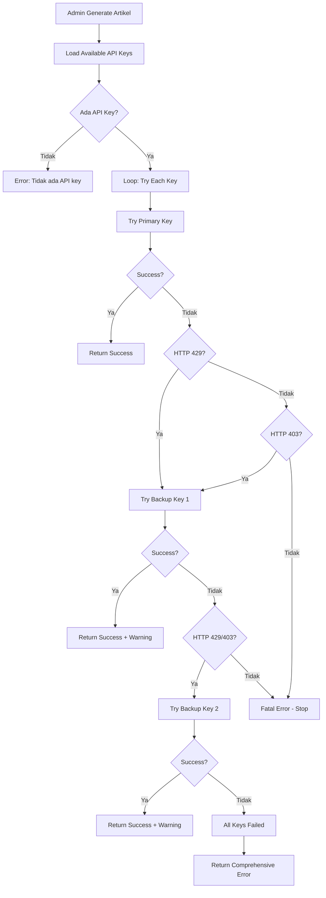

# Dokumentasi Skenario Error API - Sistem Fallback

## Arsitektur Sistem Fallback

Sistem ini menggunakan **multiple API keys** dengan mekanisme fallback otomatis untuk meningkatkan reliability:

- **Primary Key**: `GEMINI_API_KEY` (API key utama)
- **Backup Key 1**: `GEMINI_API_KEY_2` (cadangan pertama)
- **Backup Key 2**: `GEMINI_API_KEY_3` (cadangan kedua)

### Flow Diagram Fallback Mechanism



---

## Skenario 1: Quota Habis - Fallback Berhasil ✅

### Deskripsi
Primary API key kehabisan quota, tetapi backup key masih tersedia dan berhasil.

### Step-by-Step Flow

#### Backend Process

1. **Admin trigger generate artikel**
   - User mengisi judul artikel
   - Klik tombol "Generate dengan AI"
   - Frontend disable button dan tampilkan loading

2. **Request dikirim ke backend**
   ```javascript
   POST /ai_article_generator.php
   Body: { judul: "Teknologi AI di Indonesia" }
   ```

3. **Backend load available API keys**
   ```php
   // File: ai_article_generator.php, line 131
   $apiKeys = getAvailableApiKeys();
   // Result: [
   //   {key: "AIza...", name: "Primary Key"},
   //   {key: "AIzb...", name: "Backup Key 1"},
   //   {key: "AIzc...", name: "Backup Key 2"}
   // ]
   ```

4. **Try Primary Key (Loop iteration 1)**
   ```php
   // File: ai_article_generator.php, line 239
   $result = callGeminiAPI($currentKey, $data);
   ```

5. **Gemini API return HTTP 429**
   ```json
   {
     "error": {
       "code": 429,
       "message": "Resource has been exhausted (e.g. check quota).",
       "status": "RESOURCE_EXHAUSTED"
     }
   }
   ```

6. **Backend detect quota exceeded**
   ```php
   // File: ai_article_generator.php, line 259
   if ($result['httpCode'] == 429) {
       debug_log("Quota exceeded for Primary Key, trying next key...");
       continue; // Lanjut ke key berikutnya
   }
   ```

7. **Try Backup Key 1 (Loop iteration 2)**
   ```php
   // File: ai_article_generator.php, line 239
   $result = callGeminiAPI($apiKeys[1]['key'], $data);
   ```

8. **Backup Key 1 berhasil (HTTP 200)**
   ```json
   {
     "candidates": [{
       "content": {
         "parts": [{"text": "Artikel lengkap tentang..."}]
       },
       "finishReason": "STOP"
     }]
   }
   ```

9. **Backend detect success**
   ```php
   // File: ai_article_generator.php, line 249
   if ($result['success']) {
       $usedKeyName = "Backup Key 1";
       break; // Keluar dari loop
   }
   ```

10. **Backend return success dengan warning**
    ```php
    // File: ai_article_generator.php, line 305-306
    if ($usedKeyName !== 'Primary Key') {
        $warningMsg .= " ℹ️ (Menggunakan Backup Key 1)";
    }
    ```

11. **Response JSON ke frontend**
    ```json
    {
      "success": true,
      "article": "Teknologi kecerdasan buatan (AI) telah berkembang...",
      "message": "✅ Artikel berhasil di-generate oleh AI! ℹ️ (Menggunakan Backup Key 1)",
      "debug": {
        "text_length": 1250,
        "sentence_count": 28,
        "finish_reason": "STOP",
        "model": "gemini-2.5-flash",
        "api_key_used": "Backup Key 1",
        "keys_tried": [
          {
            "name": "Primary Key",
            "success": false,
            "httpCode": 429,
            "error": "Resource has been exhausted"
          },
          {
            "name": "Backup Key 1",
            "success": true,
            "httpCode": 200,
            "error": null
          }
        ]
      }
    }
    ```

#### Frontend Process

12. **Frontend receive response**
    ```javascript
    // Success callback
    if (response.success) {
        // Populate textarea dengan artikel
        document.getElementById('isi').value = response.article;
    }
    ```

13. **Display success alert dengan info**
    ```html
    <div class="alert alert-success">
      ✅ Artikel berhasil di-generate oleh AI! ℹ️ (Menggunakan Backup Key 1)
    </div>
    ```

14. **Button restored**
    - Loading spinner hilang
    - Button enabled kembali
    - Admin dapat edit artikel atau submit

---

## Skenario 2: Semua API Key Quota Habis ❌

### Deskripsi
Semua API keys (Primary + Backup) kehabisan quota.

### Step-by-Step Flow

#### Backend Process

1. **Admin trigger generate artikel** (sama seperti Skenario 1, steps 1-3)

2. **Try Primary Key → HTTP 429**
   ```php
   // Iteration 1: Primary Key
   $result['httpCode'] = 429;
   $result['error'] = "Resource has been exhausted";
   // Continue to next key
   ```

3. **Try Backup Key 1 → HTTP 429**
   ```php
   // Iteration 2: Backup Key 1
   $result['httpCode'] = 429;
   $result['error'] = "Resource has been exhausted";
   // Continue to next key
   ```

4. **Try Backup Key 2 → HTTP 429**
   ```php
   // Iteration 3: Backup Key 2
   $result['httpCode'] = 429;
   $result['error'] = "Resource has been exhausted";
   // Loop selesai, semua key gagal
   ```

5. **Backend detect all keys failed**
   ```php
   // File: ai_article_generator.php, line 350-373
   if ($result && $result['success']) {
       // ... success handling
   } else {
       // Semua API keys gagal
       debug_log("All API keys failed", $triedKeys);
   }
   ```

6. **Check last error type**
   ```php
   // File: ai_article_generator.php, line 357-358
   if ($lastError['httpCode'] == 429) {
       $errorMessage = '❌ Semua API key kehabisan quota! Silakan tambahkan API key baru di file .env (GEMINI_API_KEY_2, GEMINI_API_KEY_3)';
   }
   ```

7. **Return comprehensive error JSON**
   ```json
   {
     "success": false,
     "message": "❌ Semua API key kehabisan quota! Silakan tambahkan API key baru di file .env (GEMINI_API_KEY_2, GEMINI_API_KEY_3)",
     "debug": {
       "keys_tried": [
         {
           "name": "Primary Key",
           "success": false,
           "httpCode": 429,
           "error": "Resource has been exhausted"
         },
         {
           "name": "Backup Key 1",
           "success": false,
           "httpCode": 429,
           "error": "Resource has been exhausted"
         },
         {
           "name": "Backup Key 2",
           "success": false,
           "httpCode": 429,
           "error": "Resource has been exhausted"
         }
       ],
       "last_error": {
         "success": false,
         "httpCode": 429,
         "error": "Resource has been exhausted"
       }
     }
   }
   ```

#### Frontend Process

8. **Frontend receive error response**
   ```javascript
   // Error callback
   if (!response.success) {
       // Display error message
   }
   ```

9. **Display alert-danger**
   ```html
   <div class="alert alert-danger">
     ❌ Semua API key kehabisan quota! Silakan tambahkan API key baru di file .env (GEMINI_API_KEY_2, GEMINI_API_KEY_3)
   </div>
   ```

10. **Button restored**
    - Loading spinner hilang
    - Button enabled kembali
    - Admin dapat:
      - Retry generate (jika sudah menambah API key baru)
      - Tulis artikel manual
      - Tunggu quota reset (biasanya 24 jam)

---

## Skenario 3: API Key Invalid - Fallback Berhasil ⚠️

### Deskripsi
Primary API key tidak valid (expired/revoked), tetapi backup key masih valid.

### Step-by-Step Flow

1. **Admin trigger generate artikel** (sama seperti Skenario 1, steps 1-3)

2. **Try Primary Key → HTTP 403**
   ```json
   {
     "error": {
       "code": 403,
       "message": "API key not valid. Please pass a valid API key.",
       "status": "PERMISSION_DENIED"
     }
   }
   ```

3. **Backend detect invalid key**
   ```php
   // File: ai_article_generator.php, line 265-267
   if ($result['httpCode'] == 403) {
       debug_log("API key invalid for Primary Key, trying next key...");
       continue;
   }
   ```

4. **Try Backup Key 1 → Success (HTTP 200)**

5. **Return success dengan warning**
   ```json
   {
     "success": true,
     "article": "...",
     "message": "✅ Artikel berhasil di-generate oleh AI! ℹ️ (Menggunakan Backup Key 1)"
   }
   ```

---

## Skenario 4: Fatal Error - Immediate Stop 🛑

### Deskripsi
Error yang bukan quota/invalid key (misal: network error, API down, invalid request).

### Step-by-Step Flow

1. **Admin trigger generate artikel**

2. **Try Primary Key → HTTP 500 (Server Error)**
   ```json
   {
     "error": {
       "code": 500,
       "message": "Internal server error",
       "status": "INTERNAL"
     }
   }
   ```

3. **Backend detect fatal error**
   ```php
   // File: ai_article_generator.php, line 270-272
   // Untuk error lain (bukan quota/invalid key), langsung return error
   debug_log("Fatal error on Primary Key: " . $result['error']);
   break; // Keluar dari loop, tidak coba key lain
   ```

4. **Return error immediately**
   ```json
   {
     "success": false,
     "message": "❌ AI API Error: Internal server error",
     "debug": {
       "keys_tried": [
         {
           "name": "Primary Key",
           "success": false,
           "httpCode": 500,
           "error": "Internal server error"
         }
       ]
     }
   }
   ```

> **Catatan**: Untuk error fatal seperti ini, sistem TIDAK mencoba backup key karena kemungkinan besar semua key akan mengalami error yang sama (API down, request invalid, dll).

---

## Skenario 5: Tidak Ada API Key Dikonfigurasi ⚙️

### Deskripsi
File `.env` tidak memiliki API key yang valid.

### Step-by-Step Flow

1. **Admin trigger generate artikel**

2. **Backend load API keys**
   ```php
   // File: ai_article_generator.php, line 131
   $apiKeys = getAvailableApiKeys();
   // Result: [] (empty array)
   ```

3. **Check if empty**
   ```php
   // File: ai_article_generator.php, line 133-139
   if (empty($apiKeys)) {
       echo json_encode([
           'success' => false,
           'message' => 'Tidak ada API key yang dikonfigurasi. Tambahkan GEMINI_API_KEY di file .env'
       ]);
       exit;
   }
   ```

4. **Return error**
   ```json
   {
     "success": false,
     "message": "Tidak ada API key yang dikonfigurasi. Tambahkan GEMINI_API_KEY di file .env"
   }
   ```

---

## Konfigurasi API Keys di `.env`

### Format File `.env`

```env
# Primary API Key (Wajib)
GEMINI_API_KEY=AIzaSyXXXXXXXXXXXXXXXXXXXXXXXXXXXXXXX

# Backup API Keys (Opsional, untuk fallback)
GEMINI_API_KEY_2=AIzaSyYYYYYYYYYYYYYYYYYYYYYYYYYYYYYYY
GEMINI_API_KEY_3=AIzaSyZZZZZZZZZZZZZZZZZZZZZZZZZZZZZZZ
```

### Cara Mendapatkan API Key

1. Kunjungi [Google AI Studio](https://makersuite.google.com/app/apikey)
2. Login dengan akun Google
3. Klik "Create API Key"
4. Copy API key dan paste ke file `.env`
5. Ulangi untuk membuat backup keys

### Best Practices

- ✅ **Gunakan minimal 2 API keys** (Primary + 1 Backup)
- ✅ **Monitor quota usage** di Google Cloud Console
- ✅ **Rotate keys** jika salah satu sering quota habis
- ✅ **Jangan commit `.env`** ke Git (sudah ada di `.gitignore`)
- ✅ **Set DEBUG_MODE = false** di production

---

## Monitoring & Debugging

### Enable Debug Mode

```php
// File: ai_article_generator.php, line 8
$DEBUG_MODE = true; // Set false untuk production
```

### Debug Output Example

Ketika `DEBUG_MODE = true`, response akan include informasi detail:

```json
{
  "success": true,
  "article": "...",
  "message": "✅ Artikel berhasil di-generate oleh AI!",
  "debug": {
    "text_length": 1250,
    "sentence_count": 28,
    "finish_reason": "STOP",
    "model": "gemini-2.5-flash",
    "api_key_used": "Backup Key 1",
    "keys_tried": [
      {
        "name": "Primary Key",
        "success": false,
        "httpCode": 429,
        "error": "Resource has been exhausted"
      },
      {
        "name": "Backup Key 1",
        "success": true,
        "httpCode": 200,
        "error": null
      }
    ],
    "full_response": { /* Full API response */ }
  }
}
```

### Log Files

Debug logs ditulis ke PHP error log:

```
AI Generator Debug: Request received
AI Generator Debug: Available API keys
AI Generator Debug: Trying API key: Primary Key (key 1 of 3)
AI Generator Debug: Quota exceeded for Primary Key, trying next key...
AI Generator Debug: Trying API key: Backup Key 1 (key 2 of 3)
AI Generator Debug: Success with Backup Key 1
```

---

## Error Handling Summary

| HTTP Code | Error Type | Fallback? | Action |
|-----------|-----------|-----------|--------|
| 200 | Success | - | Return artikel |
| 429 | Quota Exceeded | ✅ Ya | Try next key |
| 403 | Invalid API Key | ✅ Ya | Try next key |
| 400 | Bad Request | ❌ Tidak | Stop immediately |
| 500 | Server Error | ❌ Tidak | Stop immediately |
| 0 | Network Error | ❌ Tidak | Stop immediately |

---

## Troubleshooting Guide

### Problem: Semua API key quota habis

**Solusi:**
1. Tambahkan API key baru di `.env`
2. Tunggu quota reset (24 jam)
3. Upgrade ke paid plan di Google Cloud

### Problem: API key tidak valid

**Solusi:**
1. Periksa API key di `.env` (tidak ada spasi, lengkap)
2. Generate API key baru di Google AI Studio
3. Pastikan API key belum expired/revoked

### Problem: Artikel terpotong

**Solusi:**
1. Sistem akan detect dan tampilkan warning: `⚠️ (Artikel mencapai batas maksimal...)`
2. Admin dapat generate ulang atau edit manual
3. Adjust `maxOutputTokens` di `ai_article_generator.php` line 198

### Problem: Artikel terlalu pendek

**Solusi:**
1. Sistem akan detect dan tampilkan warning: `⚠️ (Artikel terlalu pendek...)`
2. Generate ulang dengan judul yang lebih spesifik
3. Prompt sudah dioptimasi untuk artikel panjang (500-700 kata)

---

## Code Reference

### File Structure

```
Creating-AI/
├── ai_article_generator.php    # Main API handler dengan fallback
├── config.php                   # Load .env variables
├── .env                         # API keys configuration
└── index.php                    # Frontend dengan AJAX call
```

### Key Functions

| Function | Location | Purpose |
|----------|----------|---------|
| `getAvailableApiKeys()` | Line 29-51 | Load semua API keys dari .env |
| `callGeminiAPI()` | Line 57-101 | Execute cURL POST ke Gemini API |
| Fallback Loop | Line 233-273 | Try each key dengan error handling |
| Error Processing | Line 350-373 | Generate error message berdasarkan httpCode |

---

## Kesimpulan

Sistem fallback ini memberikan **high availability** dengan:

✅ **Automatic failover** ke backup keys  
✅ **Intelligent error handling** (retry vs stop)  
✅ **Comprehensive logging** untuk debugging  
✅ **User-friendly error messages**  
✅ **Zero downtime** selama ada backup key yang valid  

Admin tidak perlu intervensi manual ketika quota habis, sistem akan otomatis switch ke backup key dan memberikan notifikasi yang jelas.